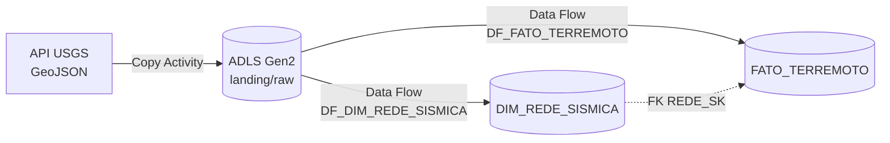
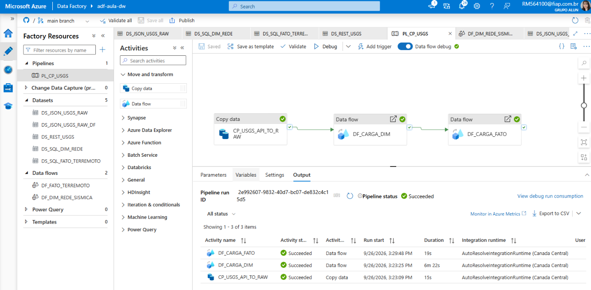
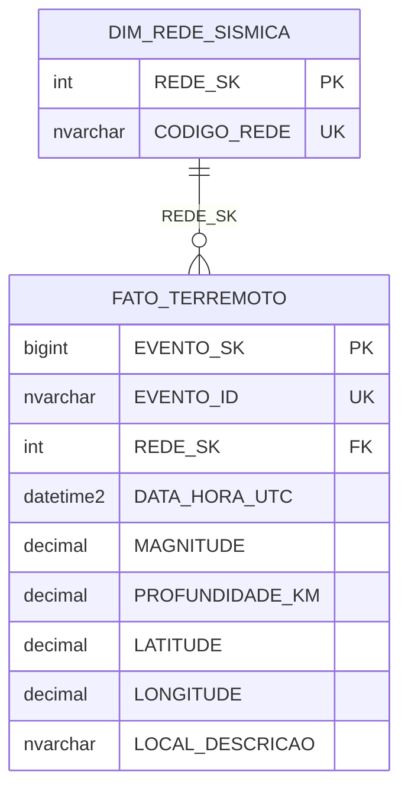
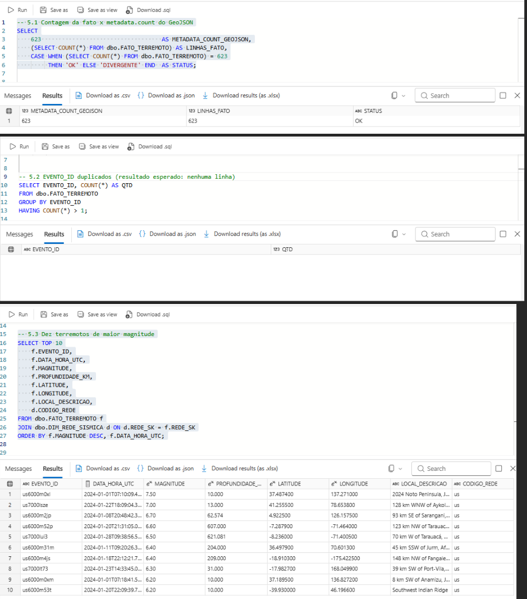

# Terremotos USGS → Data Warehouse na Azure

Pipeline de dados que coleta os terremotos de magnitude ≥ 4,5 registrados pela API pública do **USGS** (Serviço Geológico dos EUA), guarda o arquivo original em um data lake e carrega um **modelo dimensional (fato + dimensão)** no Azure SQL, pronto para consultas analíticas.


> Projeto do checkpoint de **Data Warehouse** do curso de Data Science da FIAP.

## Destaques

- **623 terremotos** de janeiro/2024 carregados, com a contagem da fato **batendo 100%** com o `metadata.count` da API.
- **Carga idempotente**: o pipeline pode ser reexecutado sem gerar duplicatas.
- **Validações de qualidade em SQL**: contagem origem × destino, checagem de chaves duplicadas e consulta analítica final.
- Resolução de um problema real de encoding (BOM no JSON), documentada em [Decisões técnicas](#decisões-técnicas).

## Arquitetura



O pipeline `PL_CP_USGS` executa três atividades em sequência, cada uma dependente do sucesso da anterior:

| # | Atividade | O que faz |
|---|---|---|
| 1 | `CP_USGS_API_TO_RAW` (Copy) | Consulta a API e grava o GeoJSON original em `landing/raw/prova_usgs/earthquakes_2024_01.geojson`, sem transformação. |
| 2 | `DF_CARGA_DIM` (Data Flow) | Desaninha `features`, agrupa as redes sísmicas distintas (`properties.net`) e insere **apenas as redes novas** na dimensão. |
| 3 | `DF_CARGA_FATO` (Data Flow) | Desaninha os eventos, converte tipos, busca a chave da rede na dimensão (Lookup) e insere **apenas os eventos novos** na fato. |



## Modelo de dados

Esquema estrela com granularidade de **um registro por terremoto**:



Transformações aplicadas na fato (arrays em Mapping Data Flow começam em 1):

```text
DATA_HORA_UTC   = toTimestamp(toLong(properties.time))      -- epoch em ms → data/hora
MAGNITUDE       = toDecimal(properties.mag, 6, 2)
LONGITUDE       = toDecimal(geometry.coordinates[1], 10, 6)
LATITUDE        = toDecimal(geometry.coordinates[2], 10, 6)
PROFUNDIDADE_KM = toDecimal(geometry.coordinates[3], 10, 3)
```

O DDL completo e as consultas de validação estão em [`sql/modelo_e_validacao.sql`](sql/modelo_e_validacao.sql).

## Resultados e validação

| Validação | Resultado |
|---|---|
| `metadata.count` do GeoJSON × linhas na fato | 623 = 623 ✅ |
| `EVENTO_ID` duplicados | nenhum ✅ |
| Eventos por rede sísmica | `us` 616 · `ak` 5 · `pr` 2 |
| Maior magnitude do mês | **M 7,5**, Península de Noto (Japão), 01/01/2024 |



## Decisões técnicas

- **Dois datasets para o mesmo arquivo raw.** Com o encoding padrão, a Copy gravava o arquivo com BOM (`EF BB BF`) e o Spark do Data Flow rejeitava o JSON. A Copy passou a gravar com `UTF-8 without BOM` (`DS_JSON_USGS_RAW`). Como esse encoding não é aceito como fonte de Data Flow, a leitura usa um segundo dataset (`DS_JSON_USGS_RAW_DF`) apontando para o mesmo arquivo.
- **Document form `Single document`**, pois o GeoJSON é um único objeto com o array `features`.
- **Cargas idempotentes.** Os dois fluxos usam a transformação *Exists* (`Doesn't exist`) contra a tabela de destino, respeitando as restrições `UNIQUE` de `CODIGO_REDE` e `EVENTO_ID`.
- **Chaves substitutas no banco.** `REDE_SK` e `EVENTO_SK` são `IDENTITY` no Azure SQL e não são mapeadas no sink.
- **Camada raw preservada.** O arquivo original fica intacto no data lake, o que permite reprocessar sem chamar a API de novo.

## Como executar

**Pré-requisitos:** assinatura Azure com Data Factory, Storage Account ADLS Gen2 (container `landing`) e Azure SQL Database.

1. No Azure SQL, execute a **Parte 3** de [`sql/modelo_e_validacao.sql`](sql/modelo_e_validacao.sql) para criar as tabelas.
2. Libere no firewall do Azure SQL o acesso de serviços do Azure.
3. Crie um Data Factory e conecte-o a este repositório em **Manage → Git configuration** (branch de colaboração `main`).
4. Edite os três linked services (`LS_REST_USGS`, `LS_ADLS_USGS`, `LS_SQL_DW`) com seus próprios endpoints e credenciais.
5. Execute o `PL_CP_USGS` via **Debug** ou **Publish → Trigger now**.
6. Rode a **Parte 5** do script SQL para validar a carga.

## Estrutura do repositório

```text
├── pipeline/       PL_CP_USGS (orquestração)
├── dataflow/       DF_DIM_REDE_SISMICA, DF_FATO_TERREMOTO
├── dataset/        REST, JSON (raw) e tabelas SQL
├── linkedService/  conexões com a API, o ADLS Gen2 e o Azure SQL
├── factory/        definição do Data Factory
├── sql/            DDL do modelo e consultas de validação
└── docs/evidencias prints da execução
```

## Próximos passos

- Parametrizar o período (`starttime`/`endtime`) e o nome do arquivo para cargas mensais incrementais.
- Adicionar uma dimensão de tempo e uma de localização (país/região).
- Criar um dashboard no Power BI sobre o modelo (magnitude × profundidade, mapa de eventos).

## Autora

**Cynthia Takematu** · [GitHub](https://github.com/cynthiatakematu)
